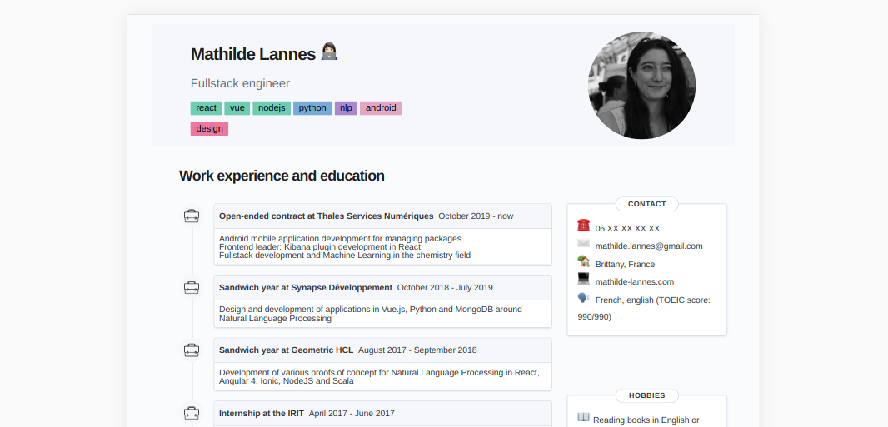

<div style="text-align:center">
    <h1> ✍️ Resume generator </h1>
</div>

<div style="text-align:center;margin-bottom:10px">
    Quickly update a resume and handle multiple languages.
</div>




## 🌟 Why my-cv ?

- Add a **new information** to your resume without breaking its layout
- Easily switch between **French and English** versions (or add any other language!)
- Download your resume as **PDF**

## 🚀 Quickstart

```bash
cd my-cv
# install dependencies
npm i
# run the app
npm start
```

Go to `localhost:3000` and tada, you're ready to update your resume!

> 💡 To have a better preview of the PDF result, go to the DevTools > Toggle device toolbar > Choose iPad Pro


## 💾 Save to PDF

1. Right-click on the page > `Print...`
2. Destination : Save as PDF
3. More settings :
    - Paper size : A4
    - Margins : None
    - Scale : Custom / 84
    - Options : check "Background graphics"

## ✍️ Update your resume

Your resume data is stored in `src/i18n/fr.json` and `src/i18n/en.json`. You must respect the JSON structure of the file to nicely display all the info. If you don't want to display a field, just use an empty value.